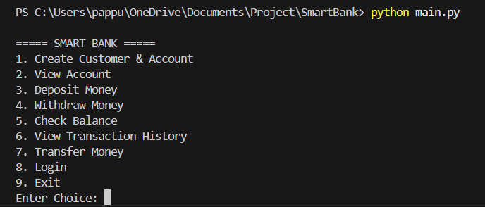
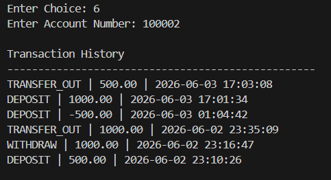

# SmartBank – Banking Management System

## Overview

SmartBank is a console-based Banking Management System developed using Python and MySQL to simulate real-world banking operations. The application enables secure customer onboarding, account lifecycle management, transaction processing, and transaction auditing through a modular and database-driven architecture.

The project demonstrates practical implementation of authentication mechanisms, password security, relational database design, transaction management, input validation, exception handling, and Python-MySQL integration.

---

## Highlights

- Developed a banking management application using Python and MySQL.
- Implemented secure authentication using SHA-256 password hashing.
- Built transaction processing modules for deposits, withdrawals, and fund transfers.
- Designed transaction auditing functionality with timestamp-based tracking.
- Enforced business-rule validations and exception handling for improved reliability.

---

## Key Contributions

### Customer & Account Management

- Implemented customer onboarding workflows integrated with a MySQL relational database.
- Developed account creation functionality with automatic account number generation.
- Enforced duplicate email and phone number validation to maintain data integrity.

### Authentication & Security

- Designed a secure authentication mechanism using SHA-256 password hashing.
- Implemented login verification using encrypted credentials.
- Developed a password migration utility to convert existing plain-text passwords into secure hashed values.

### Transaction Processing

- Developed modules for:
  - Deposits
  - Withdrawals
  - Balance Inquiry
  - Inter-Account Fund Transfers

- Implemented transaction processing logic with business-rule validation and database synchronization.

### Transaction Auditing

- Built transaction logging functionality to maintain complete transaction history.
- Recorded deposits, withdrawals, and transfers with timestamp-based tracking.
- Enabled auditability through persistent transaction records.

### Reliability & Validation

- Implemented comprehensive input validation to prevent invalid user operations.
- Added exception handling to improve application stability and user experience.
- Enforced business rules such as:
  - Account existence verification
  - Sufficient balance validation
  - Prevention of self-transfers
  - Positive transaction amount enforcement

### Software Design

- Structured the application using a modular architecture for improved maintainability and scalability.
- Separated database connectivity, customer management, account management, and transaction processing into independent modules.

---

## Technology Stack

| Technology | Purpose |
|------------|----------|
| Python | Application Development |
| MySQL | Relational Database Management |
| mysql-connector-python | Database Connectivity |

---

## Database Design

### Customers Table

Stores customer profile information.

| Column |
|----------|
| customer_id |
| name |
| email |
| phone |

### Accounts Table

Stores account details, balances, and authentication credentials.

| Column |
|----------|
| account_no |
| customer_id |
| balance |
| password |
| account_type |

### Transactions Table

Stores transaction records and audit history.

| Column |
|----------|
| transaction_id |
| account_no |
| transaction_type |
| amount |
| transaction_date |

---

## Project Structure

```text
SmartBank
│
├── account.py
├── customer.py
├── db_connection.py
├── main.py
├── update_passwords.py
├── requirements.txt
├── README.md
└── screenshots/
```

---

## Technical Skills Demonstrated

- Python Programming
- Relational Database Design
- SQL Query Development
- Database Connectivity
- Authentication & Authorization
- Password Hashing (SHA-256)
- Transaction Management
- Input Validation
- Exception Handling
- Modular Software Development
- CRUD Operations
- Data Integrity Enforcement

---

## Installation

### 1. Clone Repository


git clone https://github.com/Sowmyapappu19/SmartBank.git


### 2. Install Dependencies

```bash
pip install -r requirements.txt
```

### 3. Configure Database

- Create the SmartBank database in MySQL.
- Create the required tables.
- Update database credentials in `db_connection.py`.

### 4. Run Application

```bash
python main.py
```

---

## Sample Functionalities

- Customer Registration
- Account Creation
- Secure Login Authentication
- Deposit Funds
- Withdraw Funds
- Balance Inquiry
- Fund Transfer
- Transaction History Tracking

---

## Screenshots

### Main Menu



### Login Authentication


### Deposit Transaction


### Fund Transfer


### Transaction History



---

## Future Enhancements

- Account Statement Generation
- GUI Application using Tkinter
- Web Application using Flask/Django
- Email Notifications
- OTP-Based Authentication
- Role-Based Access Control
- REST API Integration

---

## Learning Outcomes

This project provided hands-on experience in:

- Designing relational database schemas
- Integrating Python applications with MySQL
- Implementing secure authentication workflows
- Developing transaction-processing systems
- Applying software engineering best practices
- Building reliable and maintainable modular applications

---